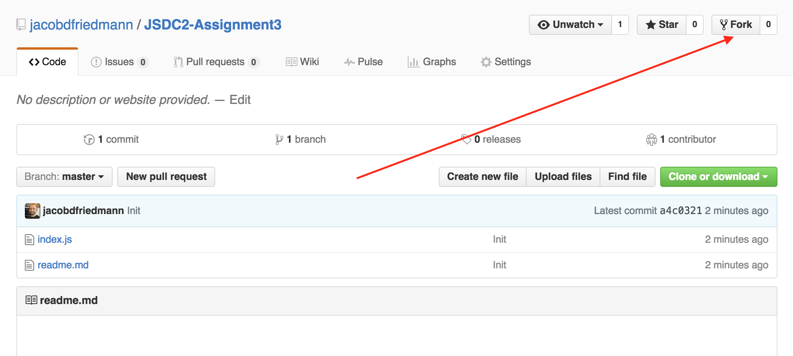
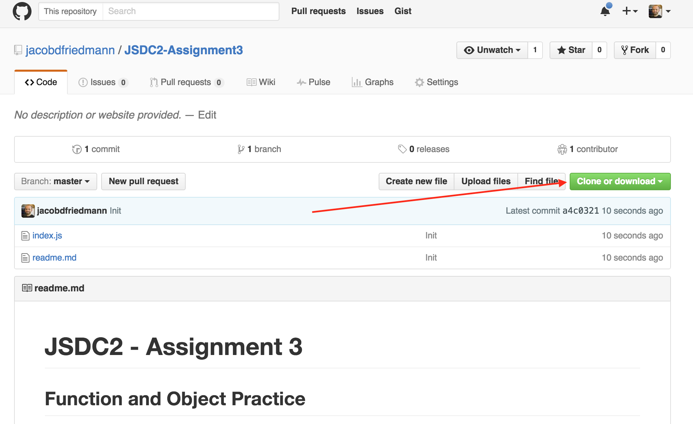
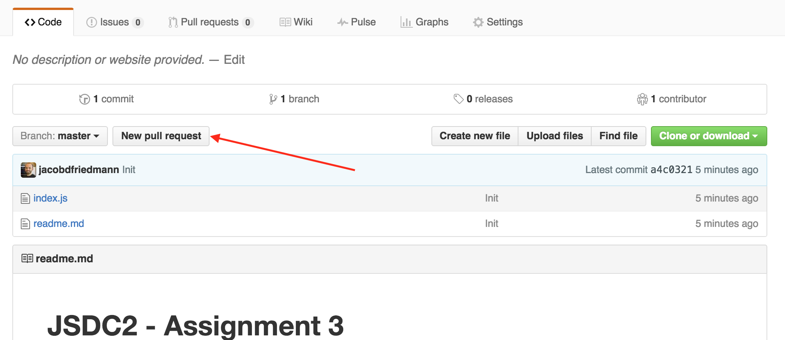
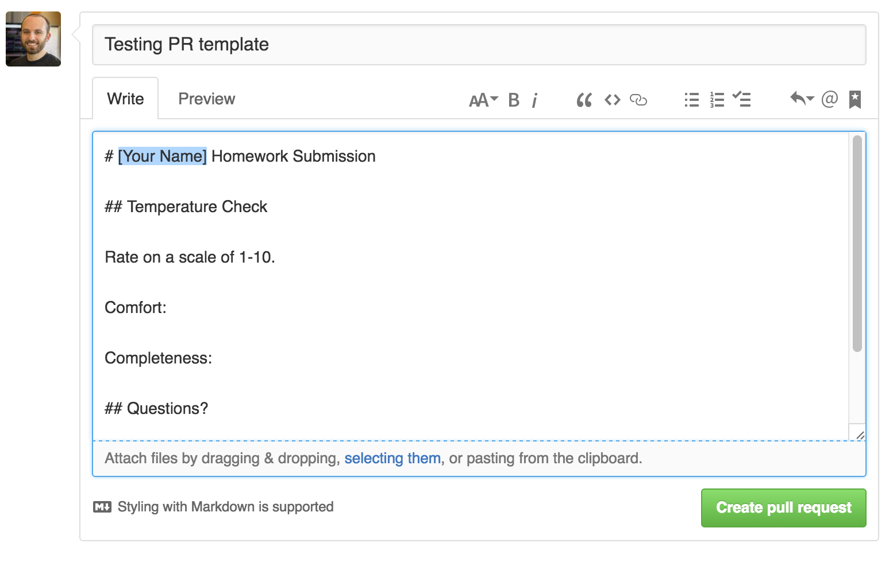

# JavaScript Development - Assignment 6
## Khanban Debugging

You've been provided with an application for keeping track of tasks on a Khanban workboard. However, there are many (8 total) bugs in the program. You're job is to find them and eliminate them. When the application is functional, the user should be able to:

- Add new task to the "To Do" column
- Load a random task for the "To Do" column
- Drag and drop tasks from one column to another
- Delete tasks when they are no longer needed

### Reading

- [Eloquent JS, Chapter 18 - Forms and Form Fields](http://eloquentjavascript.net/18_forms.html)

### Due

Monday, July 25, 2016

### Submission

- Fork the GitHub Repository

- Clone your new Fork

- Write some code!

- `git add .` your changes

- `git commit` your changes, leave a commit message

- `git push` your changes back to your fork

- Submit a pull request from your fork to the upstream project, be sure to fill out the PR message

